```mermaid
flowchart LR
    A[Tick Data\nsynthetic/dukascopy/tds/lmax] --> B[ForexDataPipeline\n1-min bars]
    B --> C[FeatureEngineer\nmicrostructure + intermarket + regime gates]
    C --> D[Labeling\nrl_reward or triple_barrier]
    C --> E[Scaling + Windowing\nStandardScaler + seq_len windows]
    D --> E
    E --> F[Backbone\nhaelt/tft/transformer/mamba/gnn/expert]
    F --> G[Head\nsingle or multitask]
    G --> H[Loss\nCE/Huber/Directional/Sharpe]
    H --> I[Train Step\nAdamW + OneCycle + AMP + grad clip]
    I --> J[Validation\nval_loss + dir_acc + val_sharpe_proxy]
    J --> K[Early Stop + Checkpoints\nbest/last + resume]
    K --> L[Optional Stages\nensemble, RL, walk-forward]
```

# Forex Scaling Model (v5.2 — 2026 Optimized)

Tick-to-trade pipeline for forex scalping at 20M-tick scale. **Version 5.2** adds **multi-pair joint training** — train all 6 architectures on EURUSD, GBPUSD, USDJPY and more simultaneously, with optional learned pair embeddings and automatic parallel data download. v5.1 introduced high-speed asynchronous data ingestion (Dukascopy) and `tqdm` training visibility.

---

## Table of Contents

1. [What's inside](#whats-inside)
2. [Requirements](#requirements)
3. [Installation — step by step](#installation--step-by-step)
4. [Running the demo](#running-the-demo)
5. [GPU training — step by step](#gpu-training--step-by-step)
6. [Multi-pair joint training](#multi-pair-joint-training)
7. [Data sources](#data-sources)
8. [Feature engineering](#feature-engineering)
9. [Labeling methods](#labeling-methods)
10. [How the model works (end-to-end)](#how-the-model-works-end-to-end)
11. [Model architectures](#model-architectures)
12. [Contrastive pre-training](#contrastive-pre-training)
13. [Risk & execution](#risk--execution)
14. [Model governance & promotion](#model-governance--promotion)
15. [Real-time monitoring stack](#real-time-monitoring-stack)
16. [Backtesting & validation](#backtesting--validation)
17. [Live trading](#live-trading)
18. [Cloud deployment (RunPod)](#cloud-deployment-runpod)
19. [Configuration reference](#configuration-reference)
20. [Tests](#tests)
21. [Project layout](#project-layout)

---

## What's inside

| Layer | Components |
|-------|-----------|
| **Data** | Dukascopy, TDS, LMAX, UTC Guard, Bad-Tick Cleaning, Economic Calendar, FRED Yield Spreads |
| **Features** | 100+ features: OFI, ATR, L2 OB, intermarket leads (DXY/Gold/Oil/Yields/Equities), correlation-breakdown detectors, 3-Tier Sentiment (Ollama/FinBERT/VADER) |
| **Labeling** | RL forward P&L labels · Triple-barrier (ATR-scaled TP/SL, Numba-accelerated) |
| **Models** | TFT · iTransformer · HAELT · Mamba · GNN · EXPERT · MultiTaskWrapper · **MultiPairWrapper** · EnsembleMetaLearner · `tqdm` Training UI |
| **Governance** | Promotion Gate (7-gates: Sharpe, PSR, TCA, PF, DD, trades, regime) · MLflow Lineage (config, metrics, git hash) |
| **Monitoring** | Demotion Monitor (Page-Hinkley) · Prometheus Exporter (15 metrics) · Discord Alerts · Grafana (13 panels) |
| **Autonomous Agents** | Real-time NLP monitor for global news/social streams that updates sentiment and macro-surprise features before chart reaction |
| **Risk** | Regime-conditional Kelly · Almgren-Chriss execution · Drawdown-aware exit · Portfolio VaR |
| **Live** | Paper broker · LMAX FIX 4.4 · OANDA REST · TIP-Search latency switching |
| **Performance** | **Async Dukascopy Loader (3–10× Speedup)** · Parquet Caching · Multiprocessing Feature Building |

---

## Requirements

| Use case | Install |
|----------|---------|
| CPU demos / exploration | `pip install -r requirements.txt` |
| GPU training (full stack) | `pip install -r requirements_gpu.txt` + CUDA PyTorch from [pytorch.org](https://pytorch.org/get-started/locally/) matching your driver |

Optional extras:
- `h5py` — HDF5 dataset caching (included in GPU requirements)
- `aiohttp` — Required for high-speed Dukascopy async downloader
- `tqdm` — Real-time training progress bars and metric tracking
- `pyyaml` — YAML run-config support (`--config config/run.yaml`)
- `wandb` — experiment tracking
- `numba` — Numba-accelerated triple-barrier scans
- `optuna` — hyperparameter search
- `mlflow` — model lineage and experiment tracking
- `prometheus_client` — metrics exporter

---

## Installation — step by step

### Step 1 — Clone the repository

```bash
git clone https://github.com/you/forex-scaling-model.git
cd forex-scaling-model/forex_scaling_model
```

### Step 2 — Create a virtual environment

```bash
python -m venv .venv
```

Activate it:

```bash
# Windows (PowerShell)
.\.venv\Scripts\Activate.ps1

# Windows (CMD)
.\.venv\Scripts\activate.bat

# macOS / Linux
source .venv/bin/activate
```

### Step 3 — Install dependencies

**CPU-only (demos, exploration, unit tests):**

```bash
pip install -r requirements.txt
```

**GPU training (full pipeline):**

```bash
# Install CUDA-enabled PyTorch first — match your driver version
# Example for CUDA 12.4 / PyTorch 2.4:
pip install torch torchvision torchaudio --index-url https://download.pytorch.org/whl/cu124

# Then install the rest
pip install -r requirements_gpu.txt
```

### Step 4 — Verify the installation

```bash
pytest tests/ -q
```

Expected output: `45 passed, 1 skipped` (all tests pass without GPU or external APIs).

### Step 5 — (Optional) Configure external services

Copy `.env` and fill in your API keys:

```bash
cp .env .env.local   # or just edit .env directly
```

| Variable | Purpose |
|----------|---------|
| `FRED_API_KEY` | Yield spread macro features (free at fred.stlouisfed.org) |
| `AV_API_KEY` | Alpha Vantage economic calendar news |
| `OANDA_API_TOKEN` / `OANDA_ACCOUNT_ID` | Live / paper trading via OANDA REST |
| `DISCORD_WEBHOOK_URL` | Live alert embeds |
| `WANDB_API_KEY` | Weights & Biases experiment tracking |
| `MLFLOW_TRACKING_URI` | MLflow server (default: `http://localhost:5000`) |
| `TIMESCALE_*` | TimescaleDB tick store |
| `KAFKA_BOOTSTRAP_SERVERS` | Kafka tick stream (default: `localhost:9092`) |
| `OLLAMA_URL` / `OLLAMA_MODEL` | Mistral-7B local LLM sentiment |

All external services are optional — the pipeline uses graceful fallbacks (synthetic data, VADER sentiment, etc.) when they are unavailable.

---

## Running the demo

The end-to-end demo runs all phases on synthetic data in ~60 seconds (CPU).

```bash
python main.py
```

**What it does — 8 phases:**

| Phase | Description |
|-------|-------------|
| **0 — Governance & Macro** | Promotion gate evaluation, MLflow setup, economic calendar, FRED yield spreads, 3-tier sentiment |
| **1 — Data pipeline** | 300k synthetic ticks → bars → 88 features → RL labels |
| **A — Advanced features** | L2 order book, tick volume imbalance, session clock, correlation regime, Hurst fractal, COT |
| **B — Model upgrades** | Granger causality GNN, meta-learner ensemble, MC Dropout uncertainty, multi-timeframe attention |
| **C — RL enhancements** | Curriculum learning (4 stages), Sharpe reward shaping, HER buffer, multi-agent DQN/PPO |
| **D — Risk & execution** | Regime-conditional Kelly, Almgren-Chriss optimal execution, drawdown circuit breaker, Portfolio VaR |
| **E — Backtesting & validation** | Monte Carlo backtest, slippage calibrator, shadow mode, walk-forward HTML report, ONNX export, lockbox |
| **F — Real-time monitoring** | Prometheus exporter, demotion monitor (Page-Hinkley), Discord alerts |

---

## GPU training — step by step

### Step 1 — Edit the run config (recommended)

`config/run.yaml` is the single place to set data source, model, epochs, and all flags:

```yaml
# config/run.yaml
data:
  source: dukascopy      # synthetic | dukascopy | tds | lmax_historical | auto
  pair:   EURUSD
  start:  "2020-01-01"
  end:    "2023-12-31"
  n_ticks: 20_000_000

model:
  name: haelt            # haelt | tft | transformer | mamba | gnn | expert

training:
  epochs:     100
  batch_size: 2048
  loss:       cross_entropy
```

Then run:

```bash
python training/train_gpu.py --config config/run.yaml
```

CLI flags still override the config file:

```bash
python training/train_gpu.py --config config/run.yaml --epochs 50 --model tft
```

> **Requires:** `pip install pyyaml`

---

### Step 2 — Basic single-model run (CLI only)

```bash
python training/train_gpu.py \
  --n-ticks 2000000 \
  --model haelt \
  --epochs 10
```

This builds (or reuses) a chunked HDF5 dataset, trains with AMP, and writes `haelt_best.pt` to `checkpoints/`.

### Step 3 — Recommended full-stack run (CLI only)

```bash
python training/train_gpu.py \
  --n-ticks 20000000 \
  --all-models \
  --epochs 100 \
  --loss cross_entropy \
  --walk-forward-cv \
  --early-stop-metric sharpe \
  --multitask \
  --pretrain --pretrain-regime --pretrain-epochs 30 \
  --train-ensemble \
  --rl-train --rl-algo dqn
```

### Step 4 — Multi-pair joint training

Train on multiple pairs simultaneously (features concatenated, labels averaged):

```bash
python training/train_gpu.py \
  --pairs EURUSD,GBPUSD,USDJPY,AUDUSD \
  --pair-embed-dim 16 \
  --data-source dukascopy \
  --data-start 2023-01-01 --data-end 2024-12-31 \
  --all-models \
  --loss cross_entropy \
  --walk-forward-cv \
  --multitask
```

Or set it in `config/run.yaml` (uncomment the `pairs:` block) then:

```bash
python training/train_gpu.py --config config/run.yaml
```

See [Multi-pair joint training](#multi-pair-joint-training) for the full reference.

### Step 5 — Memory-constrained GPU (8GB VRAM)

Use the named hardware preset:

```bash
python training/train_gpu.py \
  --hardware-profile rtx_4060_16gb_ram \
  --n-ticks 5000000 \
  --model haelt \
  --epochs 50
```

Or set it in `config/run.yaml`:

```yaml
hardware:
  profile: rtx_4060_16gb_ram
```

Sets: batch `512`, workers `2`, chunk `250k`, prefetch `2`. If you still hit OOM, append `--batch-size 384`.

### Step 5b — RTX A5000 (24GB VRAM)

Use the cloud/workstation preset:

```bash
python training/train_gpu.py \
  --hardware-profile a5000_24gb \
  --config config/run.yaml
```

Profile defaults: batch `1536`, workers `8`, chunk `500k`, prefetch `4`.

### Step 6 — Resume a stopped run

```bash
python training/train_gpu.py \
  --model haelt \
  --epochs 200 \
  --resume \
  --checkpoint-dir checkpoints/
```

`--resume` now restores the exact training state from `*_last.pt`:
- model weights
- optimizer state
- scheduler state
- AMP scaler state
- best metrics and history

### Step 6b — Quick sanity mode

```bash
python training/train_gpu.py --config config/run.yaml --quick-mode
```

Quick mode is for validation before long cloud runs:
- walk-forward enabled with max 2 folds
- max 8 supervised epochs
- max 5 pretrain epochs
- ensemble off
- RL off

### Step 6c — Cache integrity recovery (recommended on cloud)

If a cached dataset is incomplete/corrupt (for example HDF5 missing `X` or `y`),
run with auto-rebuild:

```bash
python training/train_gpu.py \
  --config config/run.yaml \
  --auto-rebuild-on-mismatch
```

This validates cache integrity at startup and, on failure, deletes cache artifacts
(`.h5`, `_X.npy`, `_y.npy`, scaler sidecar) before rebuilding cleanly.

### Step 8 — Hyperparameter search

```bash
python training/train_gpu.py \
  --model haelt \
  --hparam-search \
  --n-trials 30
```

Uses Optuna to search batch size, learning rate, dropout, and hidden dims. Best config is saved to `checkpoints/haelt_hparam.json`.

### All training flags

| Flag | Default | Description |
|------|---------|-------------|
| `--n-ticks` | `20_000_000` | Total ticks to train on |
| `--model` | `haelt` | Architecture: `tft` · `transformer` · `haelt` · `mamba` · `gnn` · `expert` |
| `--all-models` | off | Train all 6 architectures in sequence |
| `--epochs` | `100` | Training epochs per model |
| `--batch-size` | `2048` | Batch size (reduce to `512` on 8GB VRAM) |
| `--loss` | `cross_entropy` | `cross_entropy` (balanced) · `huber` · `asymmetric` · `directional_huber` · `sharpe_huber` |
| `--direction-weight` | `0.5` | Extra opposite-direction penalty for `directional_huber` |
| `--sharpe-weight` | `0.2` | Sharpe-proxy term strength for `sharpe_huber` |
| `--label-method` | `rl_reward` | `rl_reward` · `triple_barrier` |
| `--early-stop-metric` | `sharpe` | `sharpe` (default) or `loss` |
| `--early-stop-min-delta` | `0.0` | Minimum improvement needed to reset patience (noise guard) |
| `--walk-forward-cv` | off | Purged expanding-window walk-forward CV |
| `--walk-forward-folds` | `6` | Number of CV folds |
| `--multitask` | off | Replace single head with MultiTaskHead (direction CE + return Huber + confidence BCE) |
| `--mt-w-ret` | `0.5` | Multi-task return magnitude loss weight |
| `--mt-w-conf` | `0.3` | Multi-task confidence loss weight |
| `--pretrain` | off | Contrastive pre-training (TSCL) before supervised |
| `--pretrain-regime` | off | Regime-aware TSCL: same-regime positives + cross-regime hard negatives |
| `--pretrain-epochs` | `30` | Contrastive pre-training epochs |
| `--force-pretrain` | off | Delete previous contrastive encoder checkpoint(s) and restart pretraining |
| `--train-ensemble` | off | Train EnsembleMetaLearner after base models |
| `--ensemble-epochs` | `10` | Meta-learner training epochs |
| `--ensemble-div-weight` | `0.1` | Diversity penalty weight (entropy + correlation terms) |
| `--rl-train` | off | RL training (DQN or PPO) after supervised |
| `--rl-algo` | `dqn` | `dqn` or `ppo` |
| `--resume` | off | Resume from `*_best.pt` checkpoint |
| `--quick-mode` | off | Fast sanity profile: fewer folds/epochs, no ensemble/RL |
| `--integrity-gate` | on | Fail fast when cached `X`/`y` lengths mismatch |
| `--no-integrity-gate` | off | Disable strict integrity check (not recommended) |
| `--auto-rebuild-on-mismatch` | off | Delete corrupt/incomplete cache artifacts (including missing HDF5 `X`/`y`) and rebuild automatically |
| `--hparam-search` | off | Optuna hyperparameter search (`--n-trials 30`) |
| `--hardware-profile` | — | Named VRAM/RAM preset |
| `--data-source` | `synthetic` | `synthetic` · `dukascopy` · `tds` · `lmax_historical` · `auto` |
| `--data-start` | `2020-01-01` | Start date for real data sources |
| `--data-end` | `2023-12-31` | End date for real data sources |
| `--pair` | `EURUSD` | Single currency pair (overridden by `--pairs`) |
| `--pairs` | — | Comma-separated pairs for joint training: `EURUSD,GBPUSD,USDJPY` |
| `--pair-embed-dim` | `0` | Learnable pair embedding size (0 = disabled, 16 = recommended for 3+ pairs) |
| `--pair-align` | `inner` | Timestamp alignment across pairs: `inner` = common bars only, `outer` = fill NaN |
| `--cross-asset-mode` | `auto` | `auto` (real for real FX data, synthetic for synthetic FX) · `real` · `synthetic` · `off` |
| `--checkpoint-dir` | `checkpoints/` | Where to save `*_best.pt` files |
| `--data-cache` | `data/processed/` | HDF5 dataset cache directory |

---

### Cross-asset tuning knobs (FeatureEngineer)

The intermarket block in `features/feature_engineering.py` now exposes:

- `ca_corr_window` (default `60`) - rolling window for `*_corr` and `*_beta`
- `ca_regime_window` (default `240`) - baseline window for correlation-break detection
- `ca_lags` (default `(1, 5, 15)`) - lag bars for cross-asset lead/lag features
- `enable_regime_gate` (default `True`) - enables classifier-driven regime gating features

The cross-asset block is short-sample safe: rolling correlation/beta diagnostics now use warmup-friendly `min_periods`, and columns that are fully NaN on very short slices are backfilled to stable defaults before final `dropna()`.

### Trading-aware losses (2026 update)

`training/train_gpu.py` now supports objective choices that are closer to live PnL behavior than plain point error:

- `directional_huber`: Huber magnitude loss + extra penalty when prediction direction is wrong.
- `sharpe_huber`: Huber term plus a differentiable Sharpe-style proxy so the model is pushed toward better risk-adjusted returns.
- `cross_entropy`: balanced 3-class directional objective (`-1/0/+1`) for classification-style setups.

Recommended recipes:

```bash
# Direction-sensitive regression
python training/train_gpu.py \
  --loss directional_huber \
  --direction-weight 0.8 \
  --early-stop-metric sharpe \
  --early-stop-min-delta 0.0005
```

```bash
# Risk-adjusted objective
python training/train_gpu.py \
  --loss sharpe_huber \
  --sharpe-weight 0.3 \
  --early-stop-metric sharpe \
  --early-stop-min-delta 0.0005
```

### Regime filter and gating features (2s10s + Gold/DXY break)

`FeatureEngineer` includes a lightweight `RegimeGateClassifier` that produces a per-bar regime-break probability:

- Core inputs:
  - `gold_dxy_corr_break`
  - `us_2s10s_spread_chg`
  - `yield_spread_us_de_10y_chg`
  - `risk_off_signal`
- Output:
  - `regime_break_prob` in `[0, 1]`
- Derived gates:
  - `gate_gold_weight` (increases in stressed/geopolitical regimes)
  - `gate_yield_weight` (decreases when traditional macro links break)
  - `gate_risk_weight` (increases with regime-break probability)

This gives downstream models an explicit "rules are changing" channel instead of forcing one static mapping across economic and geopolitical regimes.

### Where commodity/yield data comes from

`train_gpu.py` now supports external cross-asset loading via `data/cross_asset.py`.

- Source: provider fallback chain (`auto`): Stooq daily public CSV, then Yahoo (`yfinance`).
- Assets attempted: `WTI`, `GOLD`, `COPPER`, `DXY`, `SPX`, `NASDAQ100`, `VIX`, `US10Y`, `US2Y`, `DE10Y`, `BTC`.
- Cache path: `data/processed/cross_asset/` (reused across runs).
- Fallback behavior:
  - if `--cross-asset-mode auto` and FX source is `synthetic`, synthetic cross-asset series are used;
  - if external fetch fails or symbols are unavailable, missing assets fall back to synthetic generation so feature shape stays stable.

Example (force real external cross-asset fetch):

```bash
python training/train_gpu.py \
  --data-source dukascopy \
  --data-start 2023-01-01 --data-end 2024-12-31 \
  --cross-asset-mode real
```

These are constructor parameters on `FeatureEngineer` and can be wired into runtime config if you want run-to-run control from CLI/YAML.

---

## Multi-pair joint training

Train a single model on multiple forex pairs simultaneously. Features are computed per-pair independently, then concatenated on the feature axis so every bar in the batch contains information from all pairs at once.

### How it works

```
EURUSD ticks → feature engineering → (N, T, F)  ─┐
GBPUSD ticks → feature engineering → (N, T, F)  ─┼─ concat → (N, T, P×F) → model
USDJPY ticks → feature engineering → (N, T, F)  ─┘

Labels: mean(label_EURUSD, label_GBPUSD, label_USDJPY) → single y per bar
```

The model learns **universal forex patterns** shared across pairs instead of overfitting to one pair's quirks. Walk-forward CV, multitask head, contrastive pre-training, and ensemble meta-learner all work unchanged.

### Quickstart — via CLI

```bash
python training/train_gpu.py \
  --pairs EURUSD,GBPUSD,USDJPY,AUDUSD \
  --data-source dukascopy \
  --data-start 2023-01-01 --data-end 2024-12-31 \
  --model haelt \
  --loss cross_entropy \
  --walk-forward-cv \
  --multitask
```

All 4 pairs are downloaded in parallel (async Dukascopy loader). The joint dataset is cached as a single HDF5 file keyed to the sorted pair list — subsequent runs reuse it instantly.

### Quickstart — via `config/run.yaml`

Uncomment the `pairs` block in `config/run.yaml`:

```yaml
data:
  source: dukascopy
  # pair: EURUSD         # ignored when pairs: is set
  pairs:
    - EURUSD
    - GBPUSD
    - USDJPY
    - AUDUSD
  pair_embed_dim: 16     # optional: learned pair token (0 = off)
  pair_align: inner      # inner = common bars only (recommended)
  start: "2023-01-01"
  end:   "2024-12-31"
```

Then run:

```bash
python training/train_gpu.py --config config/run.yaml
```

### Pair embedding (optional, `--pair-embed-dim 16`)

When `pair_embed_dim > 0`, a `MultiPairWrapper` is added around the backbone. Each pair gets a learned `embed_dim`-dimensional token that is concatenated to its features before the model sees them:

```
(B, T, P×F) → split → (B, T, P, F)
                         + embed(pair_id) → (B, T, P, F+E)
                         flatten → (B, T, P×(F+E)) → backbone
```

This lets the model explicitly distinguish EURUSD from GBPUSD patterns even when the raw features look similar.

```python
from models.architectures import HAELTHybrid, MultiPairWrapper

backbone = HAELTHybrid(input_size=3 * (48 + 16), seq_len=60, num_classes=3)
model    = MultiPairWrapper(backbone, n_pairs=3, f_per_pair=48, embed_dim=16)

out = model(x)   # x: (B, T, 3*48) — pairs concatenated, embedding added inside
```

### Pair embedding off (default, `--pair-embed-dim 0`)

No wrapper is added. The backbone simply receives all pairs' features concatenated: `(B, T, P×F)`. This works out-of-the-box with every architecture and adds zero extra parameters.

### Data download only (no training)

```bash
# Download 4 pairs in parallel, save as parquet
python - <<'EOF'
from data.sources import DukascopyLoader
loader = DukascopyLoader(concurrency=32, verbose=True)
dfs = loader.load_multiple(
    ["EURUSD", "GBPUSD", "USDJPY", "AUDUSD"],
    start="2023-01-01", end="2024-12-31",
    hours=list(range(7, 18)),   # London + NY session
)
for pair, df in dfs.items():
    df.to_parquet(f"data/raw/{pair}_2023_2024.parquet")
    print(f"{pair}: {len(df):,} ticks")
EOF
```

### Cache key

Multi-pair datasets are cached separately from single-pair ones. The filename encodes the sorted pair list:

```
data/processed/dataset_AUDUSD-EURUSD-GBPUSD-USDJPY_20000000_dukascopy_60_rl_reward.h5
```

Changing which pairs you train on automatically triggers a fresh build.

---

## Data sources

The `ForexDataManager` uses an automatic fallback chain:

```
lmax_live → tds → dukascopy → synthetic
```

### Dukascopy high-speed async downloader

The `DukascopyLoader` was refactored in v5.1 to use `asyncio` and `aiohttp`, delivering **3–10× faster** initialization for large tick datasets.

```python
from data.sources import DukascopyLoader

loader = DukascopyLoader(
    cache_dir="data/raw/dukascopy",
    concurrency=128,      # Max simultaneous requests (asyncio semaphore)
    request_delay=0.005,  # Polite delay per request (safe for Dukascopy)
)

# Single pair — automatic async fetch + Parquet caching
# ~200k ticks for 3 days in 35 seconds (vs 2+ minutes legacy)
df = loader.load("EURUSD", start="2024-01-01", end="2024-01-03")

# Multiple pairs — internally parallelized
dfs = loader.load_multiple(
    ["EURUSD", "GBPUSD", "USDJPY"],
    start="2024-01-01", end="2024-01-07",
    hours=list(range(7, 18)),   # London + NY session only
)
```

Hour-files are cached to disk as Parquet on first download; subsequent calls load from cache with no HTTP requests.

### Real-time Training Visibility (`tqdm`)

In v5.1, `train_gpu.py` and `pretrain/contrastive.py` feature nested `tqdm` progress bars. This provides:
- **Total Progress**: Track entire multi-epoch sessions.
- **Batch-Level Tracking**: Real-time batch-per-second and current training loss.
- **Validation Feedback**: Interactive validation progress during the evaluation phase.

```bash
# Example Output
Train HAELT:  10%|██        | 5/50 [01:25<12:12, ep/s]
  Ep   6/50 [Tr]:  45%|████▍     | 180/400 [00:15<00:18, batch/s, loss=0.452]
```

### Economic Calendar

Tracks high-impact events (NFP, CPI, FOMC, Rate Decisions) and produces:

| Feature | Description |
|---------|-------------|
| `eco_minutes_to_next` | Minutes until the next scheduled high-impact release |
| `eco_minutes_since_last` | Minutes since the last release |
| `eco_surprise_norm` | `(Actual − Forecast) / |Prior|` |
| `eco_release_flag` | Boolean: within ±15 min of a release |

### FRED Yield Spreads

Fetches real-time G10 yield spreads (US10Y, DE10Y, JP10Y, GB10Y, AU10Y, CA10Y) via FRED API. Provides long-term "carry" directional bias. Falls back to a synthetic correlated random walk if FRED is unavailable.

---

## Feature engineering

88+ features across four modules.

### Micro + intermarket features (`features/feature_engineering.py`)

Core price/microstructure:
- ATR (6-period), OFI (20-period), Trade Arrival Rate (30-window)
- RSI (14), MACD (12/26/9), Bollinger Bands (20, +/-2sigma)
- Lagged FX returns (`[5, 20, 60]` by default)

Cross-currency and intermarket predictors:
- Asset return + lag stack for `DXY`, `GOLD`, `WTI`, `COPPER`, `IRON_ORE`, `SPX`, `NASDAQ100`, `VIX`, `BTC`, `US10Y`, `DE10Y`, `US2Y`
- Rolling asset-vs-FX `corr` and `beta` features (configurable windows)
- Bond spread features:
  - `yield_spread_us_de_10y`, `yield_spread_us_de_10y_chg`
  - `us_2s10s_spread`, `us_2s10s_spread_chg`
- Regime and breakdown diagnostics:
  - `risk_off_signal` (SPX down + VIX up proxy)
  - `gold_dxy_corr`, `gold_dxy_corr_break`
  - `commodity_fx_lead` (lagged copper/oil blend)

The feature builder accepts external cross-asset series when available and falls back to synthetic correlated series for offline/reproducible runs.

### Market microstructure (`features/advanced_features.py`)

| Feature group | What it captures |
|---------------|-----------------|
| **L2 Order Book** (10 levels) | Bid/ask depth, imbalance, microprice, bid/ask walls |
| **Tick Volume Imbalance** | Buy/sell volume ratio, impact acceleration |
| **Session Clock** | Tokyo (0-9), London (7-16), NY (12-21), Sydney (21-6 UTC) + overlaps |
| **Correlation Regime** | Rolling Pearson, eigenvalue ratio, z-score, breakdown detector |
| **Hurst + Fractal** | Trending (H > 0.6) vs mean-reverting (H < 0.4) classifier |
| **Options Skew Proxy** | IV, risk-reversal, term structure |
| **COT Positioning** | Institutional long/short bias |

### Macro features (`features/macro_features.py`)

FRED-sourced yield spreads (US-DE, US-JP, US-GB, AU-US, US-CA), per-pair carry differential, 5d/20d yield momentum, 20d rolling volatility of primary spread.

### 3-Tier Sentiment (`features/finbert_sentiment.py`)

A redundant cascade ensuring sentiment is always available:

1. **Ollama (Mistral-7B)** — Primary deep news analysis (hosted locally on `:11434`)
2. **FinBERT** — Fallback HuggingFace transformer (GPU/CPU, ProsusAI/FinBERT, 768-dim)
3. **VADER** — Fast, offline, rule-based fallback (zero dependencies)

### Autonomous agents (real-time NLP loop)

The pipeline supports an agent-style pattern where a lightweight monitor continuously ingests headlines, macro event text, and social sentiment, then updates model-side sentiment features before price reacts.

Typical loop:
1. Ingest news/social streams (RSS/APIs/webhooks) and timestamp to UTC.
2. Run NLP scoring (Ollama/FinBERT/VADER fallback chain).
3. Convert to market features (`sentiment_decayed`, `buzz`, `eco_surprise`).
4. Feed updated features into the prediction window for the next bars.

Recommended safety controls:
- Add max-update frequency and debounce windows to avoid over-reacting to duplicate headlines.
- Keep a confidence threshold so weak/ambiguous text does not perturb live signals.
- Log all text-to-feature transformations for post-trade attribution and governance.

---

## Labeling methods

### RL reward (`labeling/rl_reward_labeling.py`)

Per-bar forward P&L reward. Simulates long/short entry (buy at ask, sell at bid), exits on:
- Profit target: ATR × 1.5
- Stop loss: ATR × 1.0
- Lookahead horizon: 10 bars

Transaction cost of 1.5 pips is deducted. Outputs `label` ∈ {-1, 0, +1}.

### Triple-barrier (`labeling/triple_barrier_labeling.py`)

ATR-scaled TP (1.5×) / SL (1.0×) with a 10-bar lookahead window. Numba-accelerated parallel scans with serial fallback. Outputs class labels {0, 1, 2} or continuous returns.

---

## How the model works (end-to-end)

This section describes the exact learning loop used by `training/train_gpu.py`, from raw ticks to saved checkpoints.

### 1) Data ingestion and bar building

- Source can be `synthetic`, `dukascopy`, `tds`, `lmax_historical`, or `auto`.
- Raw ticks are resampled into 1-minute bars by `ForexDataPipeline`.
- In single-pair mode, one pair is processed; in multi-pair mode (`--pairs`), each pair is processed independently, then aligned.
- Datasets are cached (`.h5` or NPY sidecars), with integrity checks and optional auto-rebuild.

### 2) Feature engineering (market state representation)

`FeatureEngineer` builds a dense state vector per bar that combines:

- Microstructure (`ofi`, `obi_proxy`, `tar`, ATR, volatility, Bollinger, RSI, MACD, lag returns)
- Intermarket block (`DXY`, yields, commodities, equities, VIX, BTC returns/corr/beta)
- Regime diagnostics (`gold_dxy_corr_break`, curve shifts, risk-off proxy)
- Regime gates (`regime_break_prob`, `gate_gold_weight`, `gate_yield_weight`, `gate_risk_weight`)
- Optional sentiment/macro event features (`sentiment_decayed`, `buzz`, `eco_surprise`)

Cross-asset sourcing behavior:

- `--cross-asset-mode auto`: uses real external panel for real FX data sources, synthetic panel for synthetic FX runs
- `--cross-asset-mode real`: always attempts external panel download
- Missing external symbols fall back to synthetic series so feature shape remains stable

### 3) Label construction (what the model learns)

You can train on two target definitions:

- `rl_reward`: forward PnL-style labels with ATR TP/SL and transaction costs
- `triple_barrier`: ATR-scaled barrier labels with vertical timeout

After labeling, features and targets are aligned and converted into rolling sequences:

- Input tensor: `X` with shape `(batch, seq_len, n_features)`
- Target tensor: `y` at the last bar of each sequence

### 4) Scaling and sequence creation

- `StandardScaler.partial_fit` is applied incrementally per chunk to avoid RAM blowups.
- Scaled rows are converted to sliding windows (`seq_len`, default 60 bars).
- In multi-pair mode, per-pair windows are concatenated along feature axis:
  - `(N, T, F)` per pair -> `(N, T, P*F)` joint tensor

### 5) Model forward pass and objectives

Backbones (`haelt`, `tft`, `transformer`, `mamba`, `gnn`, `expert`) read each sequence and produce either:

- Scalar/regression output
- 3-class logits (`sell/hold/buy`)
- Multi-task tuple (`direction_logits`, `return_hat`, `confidence`) when `--multitask` is enabled

Supported training losses:

- `cross_entropy`: balanced 3-class directional objective
- `huber`: robust regression objective
- `asymmetric`: direction-aware penalty variant
- `directional_huber`: Huber + extra wrong-direction penalty
- `sharpe_huber`: Huber + Sharpe proxy term (risk-adjusted objective)

### 6) Optimization and stability controls

- Optimizer: `AdamW`
- LR schedule: `OneCycleLR`
- Mixed precision: `torch.amp` (`autocast` + `GradScaler`) on CUDA
- Gradient clipping: `--grad-clip`
- OOM handling: batch is skipped safely, cache cleared, training continues

### 7) Validation, Sharpe proxy, and early stopping

Each epoch computes:

- `train_loss`
- `val_loss`
- Directional accuracy (`dir_acc`)
- Validation Sharpe proxy (`val_sharpe_proxy`) from predicted direction × realized label

Early stopping can monitor:

- `--early-stop-metric sharpe` (maximize), or
- `--early-stop-metric loss` (minimize)

with `--early-stop-min-delta` to avoid resetting patience on tiny noisy changes.

### 8) Checkpointing and resume behavior

The trainer writes:

- `*_best.pt` for best validation objective
- `*_last.pt` for exact resume state

Resume restores model weights, optimizer, scheduler, AMP scaler, and training history, so long jobs can continue without losing LR phase or patience counters.

### 9) Optional advanced stages

- Contrastive pretraining (`--pretrain`, optional regime-aware mode)
- Ensemble meta-learner (`--train-ensemble`)
- RL fine-tuning (`--rl-train` with DQN/PPO)
- Walk-forward CV (`--walk-forward-cv`) for time-aware robustness

Conceptual flow:

```text
ticks -> bars -> features (+ cross-asset + regime gates) -> labels
      -> scaler + windowing -> model backbone/head -> loss
      -> optimizer/scheduler/AMP -> validation (loss + Sharpe proxy)
      -> early stop + checkpoints -> optional ensemble/RL stages
```



---

## Model architectures

All models implement `forward(x: Tensor[B, T, F]) → Tensor[B]` (scalar) or `Tensor[B, 3]` (3-class logits). Defined in `models/architectures.py`.

| Name | Key idea | Latency |
|------|----------|---------|
| `TFTScalper` | Variable Selection Networks + LSTM + self-attention for feature importance weighting | ~4ms |
| `iTransformerScalper` | Attention across the feature dimension (variates as tokens, not timesteps) | ~4ms |
| `HAELTHybrid` | LSTM (microstructure) ‖ Transformer (long-range), gated fusion | ~5ms |
| `MambaScalper` | State-space model, O(L) complexity, selective recurrence with 1D conv + gating | ~2ms |
| `GNNFromSequence` | Cross-asset graph with learned adjacency (`adj_logits` Parameter) | ~4ms |
| `EXPERTEncoder` | No positional encoding, 1D ConvFFN layers instead of MLP FFN | ~3ms |

### Building a model

```python
from models.architectures import build_model

model = build_model("haelt", input_size=73, seq_len=60, d_model=64, nhead=4)
```

`build_model` filters kwargs to each architecture's accepted parameters automatically.

### LSTM networks (sequence memory)

LSTM is already a first-class component in this project:
- `HAELTHybrid` uses an LSTM branch to model short-horizon microstructure dynamics.
- `TFTScalper` includes LSTM temporal processing before attention layers.

Why it matters for FX:
- Captures lead-lag behavior across bars (minutes to hours) better than static feature models.
- Handles non-linear temporal dependencies between intermarket inputs (DXY, yields, commodities, equities) and target pair moves.
- Provides stable sequence memory when correlations temporarily weaken or shift regimes.

### Multi-pair wrapper (`--pairs` + `--pair-embed-dim`)

`MultiPairWrapper` sits in front of any backbone and adds a learnable pair embedding to each pair's features before flattening for the backbone. See [Multi-pair joint training](#multi-pair-joint-training) for full details.

### Multi-task head (`--multitask`)

`MultiTaskWrapper` replaces any backbone's `.head` with three parallel branches:

```
backbone hidden state
    ├── direction  →  CrossEntropy  (sell / hold / buy)
    ├── return_hat →  Huber         (expected pip return)
    └── confidence →  BCE           (predicted |return|, used as position-size signal)
```

```python
from models.architectures import HAELTHybrid, MultiTaskWrapper, MultiTaskLoss

base    = HAELTHybrid(input_size=73, seq_len=60)
model   = MultiTaskWrapper(base, head_in=128)   # head_in = lstm_hidden + d_model
crit    = MultiTaskLoss(w_dir=1.0, w_ret=0.5, w_conf=0.3)

logits, ret_hat, conf = model(x)    # x: (B, T, F)
loss = crit(logits, ret_hat, conf, y_cls, y_cont)
```

### Ensemble meta-learner (`--train-ensemble`)

`EnsembleMetaLearner` learns dynamic per-regime weights across all 6 base models. `train_meta_learner()` freezes base model weights and trains only the meta-network with a diversity penalty:

```
L = MSE(weighted_output, target)
  − div_weight × H(weights)          # maximise weight entropy → no collapse to one model
  + div_weight × corr(base_preds)    # penalise correlated base predictions
```

```python
from models.ensemble import EnsembleMetaLearner, train_meta_learner

meta    = EnsembleMetaLearner(base_models, context_dim=32, hidden=64)
history = train_meta_learner(meta, train_loader, epochs=10, diversity_weight=0.1)
pred, weights = meta(x)   # weights: (B, n_models) — which model dominates this bar
```

---

## Contrastive pre-training

### Standard TSCL (`--pretrain`)

NT-Xent (SimCLR) loss on two randomly augmented views of the same window. Four augmentation strategies:

| Strategy | Effect |
|----------|--------|
| **Jitter** | Adds Gaussian noise (σ = 0.01) |
| **Scale** | Multiplies by uniform scalar (0.8–1.2) |
| **Permute** | Shuffles 4 fixed-length segments |
| **Temporal dropout** | Zeros out 10% of timesteps |

### Regime-aware TSCL (`--pretrain --pretrain-regime`)

Extends standard TSCL with structured pair selection derived from the Parkinson fast trend score:

- **Positives** = windows from the **same market regime** (trending / mean-reverting / neutral)
- **Hard negatives** = windows from the **opposite regime**, penalised with a triplet margin loss

```
Trending       windows ──── close together  (Hurst > 0.55)
Mean-reverting windows ──── close together  (Hurst < 0.45)
                ↕ pushed apart by hard-negative margin loss
```

```python
from pretrain.contrastive import RegimeAwareTSCLTrainer

trainer = RegimeAwareTSCLTrainer(
    encoder=model,
    regime_labels=regime_labels,   # (N,) int8: 1=trending, 0=neutral, -1=mean-rev
    hard_negative_weight=1.0,
)
history = trainer.pretrain(windows, epochs=30)
```

---

## Risk & execution

### Regime-conditional Kelly (`risk/execution.py`)

Adapts the Kelly fraction based on three signals:

| Signal | Adjustment |
|--------|-----------|
| Crisis correlation (> 0.7) | Scale fraction by 0.5× |
| Trending regime (Hurst > 0.55) | Bonus ×1.2 |
| Mean-reverting regime (Hurst < 0.45) | Penalty ×0.75 |
| Volatility targeting | Annual vol target 10% |

### Almgren-Chriss executor

Optimal execution schedule minimising market impact + timing risk:
- Estimates permanent + temporary price impact
- Suggests optimal trade split count
- Outputs expected impact cost in pips

### Drawdown circuit breaker

| Threshold | Action |
|-----------|--------|
| Soft drawdown 5% | Reduce position size by 50% |
| Hard drawdown 10% | Halt trading until reset |
| Daily loss 3% | Halt for remainder of session |

### Portfolio VaR

Parametric VaR at 99% confidence with full correlation matrix. Stress CVaR scenario sets all correlations to 0.9.

### Position sizing (`sizing/kelly_criterion.py`)

| Parameter | Default |
|-----------|---------|
| Fractional Kelly | 0.25 |
| Max position size | 5% of equity |
| Pyramid add | 25% of base size |
| Martingale add | 25% of base size |
| Max total lots | 3.0 |
| Scale-out targets | [25%, 50%, 75%] |

---

## Model governance & promotion

### 7-Gate promotion check (`validation/promotion_gate.py`)

Every model must pass all 7 gates before moving to production:

| Gate | Threshold | Purpose |
|------|-----------|---------|
| 1. Out-of-sample Sharpe | ≥ 1.5 | Core risk-adjusted return |
| 2. Profit Factor | ≥ 1.5 | Gross wins / gross losses |
| 3. Max Drawdown | ≤ 20% | Peak-to-trough loss |
| 4. Trade Count | ≥ 500 | Statistical significance |
| 5. Regime Concentration | no regime > 75% PnL | No single-regime luck |
| 6. Transaction Cost Ratio | < 30% of gross PnL | Tradeable in real spreads |
| 7. Probabilistic Sharpe Ratio | PSR > 0% | Bailey & de Prado overfitting correction |

When `n_trials > 1`, the **Deflated Sharpe Ratio** is calculated to account for multiple backtest attempts.

### MLflow lineage (`validation/mlflow_logger.py`)

Automatically logs to MLflow (default `localhost:5000`):
- Full training config (`settings.py` snapshot)
- Per-gate metrics
- Git commit hash (code-model traceability)
- Walk-forward fold Sharpe distributions
- Checkpoint and ONNX artifact paths

### Demotion monitor — the circuit breaker (`monitoring/demotion_monitor.py`)

Tracks live performance using the **Page-Hinkley Change Detection** algorithm (delta 0.005, lambda 50.0). Triggers on:

| Floor breached | Action |
|----------------|--------|
| Sharpe < 0.5 | Automatic rollback to `production_prev.pt` |
| Win rate < 45% | Rollback + retrain flag |
| Drawdown > 20% | Rollback + writes `checkpoints/needs_retrain.flag` |

---

## Real-time monitoring stack

### Prometheus & Grafana

- 15 distinct metrics exported on `:8000/metrics` (equity, P&L, Sharpe, latency, draw­down, etc.)
- `monitoring/grafana_dashboard.json` — production-ready 13-panel command centre

Start the exporter:

```python
from monitoring.prometheus_exporter import PrometheusExporter

exp = PrometheusExporter(port=8000)
exp.start()
exp.update(equity=100250.0, sharpe=1.82, latency_ms=3.2)
```

### Discord alerts

Structured embeds for 6 alert types:

| Alert | Trigger |
|-------|---------|
| Circuit Breaker | Drawdown halt or volatility spike |
| Drift Alert | Significant model performance decay |
| Promotion | Model passed all 7 gates |
| Demotion | Model rolled back |
| Retrain | `needs_retrain.flag` written |
| TCA Breach | Transaction cost ratio exceeds 30% |

Configurable minimum interval (default: 300 seconds) to avoid alert flooding.

### SHAP feature tracker

DeepExplainer over a 500-bar background set. Raises an alert if the top-5 most important features shift by more than 30% between two consecutive retrains — a leading indicator of data drift.

---

## Backtesting & validation

### Event-driven backtester (`backtesting/backtest.py`)

Accounts for:
- Bid-ask spread (Golden Rule)
- Commission per lot
- Slippage (execution lag)
- Market impact (Square Root Law)
- Scale-in: pyramid + martingale
- Scale-out: partial profit-taking
- Dynamic trailing stops

Returns: equity curve, PnL per trade, win rate, profit factor, Sharpe.

### Monte Carlo backtest

1,000 randomized trade-order simulations producing:
- Shuffle Sharpe 95% confidence interval
- Bootstrap Sharpe 95% confidence interval

Distinguishes genuine alpha from sequence-dependent luck.

### Slippage calibrator

Power-law fit: `slippage_pips = α × (size / ADV)^β`

Calibrated from historical fills. Used to mark realistic execution costs in backtests.

### Lockbox evaluator

Seals a hold-out test set (default: 2024-H2). The lockbox is opened **exactly once** just before going live. Prevents any inadvertent leakage from repeated backtest iterations.

### ONNX export

```python
from monitoring.pipeline import ONNXExporter

exp = ONNXExporter(model, export_dir="exports/")
exp.export(input_size=(1, 60, 73))   # batch=1, seq=60, features=73
```

3–5× faster CPU inference compared to PyTorch. Round-trip numerical verification included.

### Shadow mode

Runs a candidate model in parallel with the live model for a 500-bar evaluation window. If the candidate's Sharpe is higher and signal agreement exceeds the threshold, it is automatically promoted.

### Walk-forward HTML reporter

Generates a weekly PDF/HTML report with:
- Equity curve
- Returns distribution
- Drawdown heatmap
- Per-fold Sharpe bar chart

---

## Live trading

### Brokers

| Broker | Protocol | Notes |
|--------|----------|-------|
| Paper | Internal simulation | Default; no credentials needed |
| LMAX | FIX 4.4 | Requires LMAX credentials in settings |
| OANDA | REST v20 | Requires OANDA API key in settings |

### TIP-Search latency switching

Automatically switches between a fast model (MambaScalper, ~2ms) and a slower, higher-accuracy model (HAELTHybrid, ~5ms) based on market volatility:

- If `ATR > 2× rolling avg ATR` → use fast model
- Otherwise → use accuracy-optimised model

### Starting the live engine

```bash
python trading/live_engine.py --broker paper --pair EURUSD
```

---

## Cloud deployment (RunPod)

### Step 1 — Push to GitHub

```bash
git add . && git commit -m "deploy" && git push
```

### Step 2 — Launch a GPU pod

```bash
chmod +x cloud_launch.sh

GITHUB_REPO=https://github.com/you/forex-scaling-model.git \
RUNPOD_API_KEY=your_key \
WANDB_API_KEY=your_key \
./cloud_launch.sh
```

Default pod: RTX 4090 · 24GB VRAM · 8 vCPU · 32GB RAM · 50GB network volume.

JupyterLab starts automatically on port **8888**.
TensorBoard is available on port **6006**:

```bash
tensorboard --logdir /workspace/logs --host 0.0.0.0 --port 6006
```

### RunPod command set (recommended sequence)

Run these in order to avoid burning cloud budget on broken runs.

#### A) Debug pod validation (cheap)

```bash
python -m pytest -q tests && \
python training/train_gpu.py --config config/run.yaml --quick-mode --force-rebuild
```

#### B) Calibration run (estimate time/cost)

```bash
python training/train_gpu.py \
  --config config/run.yaml \
  --model transformer \
  --epochs 5 \
  --patience 3 \
  --n-ticks 500000 \
  --walk-forward-cv \
  --cross-asset-mode auto
```

#### C) Medium-cost production profile (single model)

```bash
python training/train_gpu.py \
  --config config/run.yaml \
  --model haelt \
  --n-ticks 5000000 \
  --epochs 40 \
  --patience 6 \
  --walk-forward-cv \
  --walk-forward-folds 4 \
  --early-stop-metric sharpe \
  --early-stop-min-delta 0.001 \
  --cross-asset-mode auto
```

#### D) Full production (higher cost)

```bash
python training/train_gpu.py \
  --config config/run.yaml \
  --all-models \
  --epochs 100 \
  --early-stop-metric sharpe \
  --early-stop-min-delta 0.001 \
  --cross-asset-mode real
```

#### E) Resume after interruption

```bash
python training/train_gpu.py --config config/run.yaml --resume
```

### Step 3 — Serverless inference (on-demand, pay per call)

```bash
runpod deploy --name forex-scaler --handler runpod/handler.py
```

```bash
curl -X POST https://api.runpod.ai/v2/{endpoint_id}/run \
  -H "Authorization: Bearer $RUNPOD_API_KEY" \
  -H "Content-Type: application/json" \
  -d '{"input": {"task": "predict", "features": [[...]], "model": "haelt"}}'
```

Supported tasks: `predict` · `train` · `backtest` · `healthcheck`

---

## Configuration reference

There are two config layers:

| File | Purpose |
|------|---------|
| `config/run.yaml` | **Per-run settings** — data source, model, training flags. Edit this to change a run without touching Python. Pass with `--config config/run.yaml`. |
| `config/settings.py` | **System defaults** — architecture constants, gate thresholds, infrastructure endpoints. Edit when changing the system, not individual runs. |
| `.env` | **Secrets and credentials** — API keys, DB passwords, webhook URLs. Never commit this file. |

### `config/run.yaml` sections

| Section | Controls |
|---------|---------|
| `data` | Source (`dukascopy`/`synthetic`/`tds`/`lmax_historical`/`auto`), `pair` (single), `pairs` list (multi-pair joint training), `pair_embed_dim`, `pair_align`, date range, tick count, chunk size, cache reuse, integrity gate, auto-rebuild on mismatch |
| `model` | Architecture name, hidden dims, d_model, nhead, num_layers, dropout |
| `training` | Epochs, batch size, LR, loss, label method, early-stop metric, grad clip, AMP |
| `walk_forward` | Enable/disable walk-forward CV, number of folds |
| `multitask` | Enable multi-head training, return/confidence loss weights |
| `pretrain` | Enable TSCL pre-training, epochs, regime-aware mode |
| `ensemble` | Enable meta-learner training, epochs, diversity penalty weight |
| `rl` | Enable RL fine-tuning, DQN/PPO algorithm, episode count |
| `hardware` | Named profile (`rtx_4060_16gb_ram`, `rtx_4000_ada_cloud`, `a5000_24gb`, `a40_48gb`), num_workers, prefetch_factor |
| `quick` | Enable quick sanity profile for short validation runs |
| `tracking` | W&B project name, run name, disable W&B |
| `paths` | Override checkpoint and data-cache directories |

### `config/settings.py` sections

| Section | Controls |
|---------|---------|
| `PATHS` | All artifact directories — single source of truth |
| `DATA` | TimescaleDB/Kafka broker config, supported FX pairs |
| `FEATURES` | ATR window, lag windows, MACD, Bollinger, sentiment decay |
| `CROSS_ASSET` | Cross-asset tickers, correlation window, GNN update frequency |
| `SENTIMENT` | FinBERT dims, Mistral model ID, VADER fallback, Ollama host |
| `TRAINING` | System-level defaults for batch size, epochs, loss, OneCycleLR params |
| `HARDWARE_PROFILES` | Named presets for specific GPU+RAM combinations |
| `PRETRAIN` | Temperature, projection dim, augmentation params, pretrain LR |
| `RL` | PPO and DQN hyperparameters, reward weights, buffer size |
| `LABELING` | Lookahead bars, ATR multipliers, transaction cost |
| `SIZING` | Kelly fraction, max position, pyramid/martingale percentages |
| `RISK` | Max drawdown thresholds, halt bars, VaR confidence |
| `VALIDATION` | Purged embargo CV splits, purge/embargo bar counts |
| `MONITORING` | PSI threshold, KS p-value, check interval |
| `GOVERNANCE` | Gate thresholds, MLflow URI, Git hash logging |
| `ALERTS` | Prometheus port, Discord webhook, Page-Hinkley delta |

---

## Tests

```bash
# Run all tests
pytest tests/ -q

# Target only the multi-pair tests
pytest tests/test_models.py::TestMultiPairWrapper tests/test_models.py::TestMultiPairHelpers -v

# Specific module groups (standalone, no pytest required)
python tests/test_all.py --module models      # architectures, multitask, multi-pair, diversity, ensemble
python tests/test_all.py --module pretrain    # standard + regime TSCL, augmenters
python tests/test_all.py --module features    # feature engineering
python tests/test_all.py --module labeling    # RL labels, triple-barrier Numba parity
python tests/test_all.py --module risk        # Kelly, Almgren-Chriss, VaR, drawdown
python tests/test_all.py --module monitoring  # purged CV, drift, Monte Carlo, shadow mode
python tests/test_all.py --module live        # paper broker, tick buffer, engine init
python tests/test_all.py --fast               # skip slow tests (Hurst, Monte Carlo)
```

Test coverage for key components:

| Test class | Tests | What is covered |
|-----------|------:|----------------|
| `TestMultiTaskHead` | 2 | Output shapes, confidence in [0, 1] |
| `TestMultiTaskLoss` | 4 | Scalar output, weight scaling, backward, class weights |
| `TestMultiTaskWrapper` | 3 | 4 backbone types, large head auto-projection, gradient flow |
| `TestMultiPairWrapper` | 6 | 2-pair scalar, 4-pair scalar, 4-pair 3-class, distinct embeddings, gradient to backbone + embeddings, classification head |
| `TestMultiPairHelpers` | 10 | `_get_pairs()`: string/list/None/whitespace/empty · `_build_multipair_chunk()`: shape, inner-join alignment, label averaging, empty graceful exit, 3-pair feature count |
| `TestEnsembleDiversityLoss` | 3 | Identical → high diversity, orthogonal → low, differentiable |
| `TestTrainMetaLearner` | 3 | Loss finite, base models frozen, weights sum to 1 |
| `TestRegimeAwareTSCL` | 4 | 3-regime run, loss comparison, length mismatch, single-regime fallback |

### Multi-pair test details

**`TestMultiPairWrapper`** — `tests/test_models.py`

| Test | Description |
|------|-------------|
| `test_two_pairs_no_embed_concatenated_input` | Backbone with `2×F` input runs without wrapper (embed_dim=0 path) |
| `test_wrapper_two_pairs_with_embed_output_shape` | `MultiPairWrapper(n_pairs=2, embed_dim=8)` preserves `(B,)` output |
| `test_wrapper_four_pairs_with_embed_output_shape` | `MultiPairWrapper(n_pairs=4, embed_dim=16)` preserves `(B,)` output |
| `test_pair_embeddings_are_distinct_after_init` | Pair 0 and pair 1 embeddings differ after random initialisation |
| `test_gradient_flows_through_backbone_and_embeddings` | `backward()` reaches both backbone params and `pair_embeds.weight` |
| `test_wrapper_with_classification_head` | Works when backbone outputs `(B, 3)` 3-class logits |

**`TestMultiPairHelpers`** — `tests/test_models.py`

`_get_pairs()` — 5 tests:

| Test | Description |
|------|-------------|
| `test_get_pairs_from_comma_string` | `"EURUSD,GBPUSD,USDJPY"` → `["EURUSD", "GBPUSD", "USDJPY"]` |
| `test_get_pairs_from_list` | Python list `["eurusd", "gbpusd"]` → uppercased list |
| `test_get_pairs_fallback_to_pair_when_none` | `pairs=None` → `[args.pair]` |
| `test_get_pairs_strips_whitespace` | `" EURUSD , GBPUSD "` → `["EURUSD", "GBPUSD"]` |
| `test_get_pairs_empty_string_falls_back` | `pairs=""` → `[args.pair]` |

`_build_multipair_chunk()` — 5 tests:

| Test | Description |
|------|-------------|
| `test_multipair_chunk_concatenates_features` | 2 pairs × F features → `X.shape == (N, T, 2×F)` |
| `test_multipair_chunk_aligns_to_shortest_pair` | Pairs with N=100 and N=73 → output has 73 samples (inner join) |
| `test_multipair_chunk_averages_labels` | `y = mean(y_EURUSD, y_GBPUSD)` verified with `assert_allclose` |
| `test_multipair_chunk_empty_pairs_returns_empty` | All pairs empty → graceful `(size=0, n_feat=0)` return |
| `test_multipair_chunk_three_pairs_feature_count` | 3 pairs × 10 features → `n_feat = 30`, `X.shape[-1] = 30` |

**`test_all.py` additions** — 6 cases added to `run_model_tests()`:

```
MultiPairWrapper 2-pair scalar
MultiPairWrapper 4-pair 3-class
MultiPairWrapper gradient flow
_get_pairs() helper parsing
_build_multipair_chunk shape
_build_multipair_chunk inner join
```

---

## Project layout

```
forex_scaling_model/
├── config/
│   ├── run.yaml                 # Per-run config: data source, model, training flags
│   ├── settings.py              # System defaults: 15 sections, gate thresholds, infra
│   └── models.py                # Model registry
├── data/
│   ├── data_ingestion.py        # UTC guard, bad-tick cleaning, synthetic GBM ticks
│   ├── sources.py               # Dukascopy (parallel), TDS, LMAX; auto-fallback chain
│   └── economic_calendar.py     # High-impact event parsing & surprise normalisation
├── features/
│   ├── feature_engineering.py   # ATR, OFI, RSI, MACD, Bollinger, lag features
│   ├── advanced_features.py     # L2 OB, Parkinson, COT, Hurst, session clock, correlation
│   ├── macro_features.py        # FRED yield spreads & carry features
│   └── finbert_sentiment.py     # 3-tier sentiment cascade (Ollama / FinBERT / VADER)
├── labeling/
│   ├── rl_reward_labeling.py    # Per-bar forward P&L reward, RL labels
│   └── triple_barrier_labeling.py  # ATR-scaled TP/SL, Numba-accelerated
├── models/
│   ├── architectures.py         # 6 architectures + MultiTaskHead/Wrapper/Loss + MultiPairWrapper
│   ├── ensemble.py              # EnsembleMetaLearner, diversity_loss, train_meta_learner
│   ├── rl_agents.py             # ForexTradingEnv, DQNAgent, PPOAgent, CurriculumScheduler
│   └── rl_advanced.py           # Multi-agent PPO/DQN, HER buffer, Sharpe reward wrapper
├── pretrain/
│   └── contrastive.py           # TSCLTrainer, RegimeAwareTSCLTrainer, DriftDetector,
│                                #   PurgedEmbargoCVSplitter, WalkForwardRetrainer
├── training/
│   └── train_gpu.py             # 20M-tick pipeline with AMP, HDF5, multi-pair, all flags
├── backtesting/
│   ├── backtest.py              # Event-driven engine: spread, slippage, market impact
│   └── improvements.py          # Monte Carlo, slippage calibrator, lockbox, shadow mode
├── risk/
│   └── execution.py             # RegimeConditionalKelly, AlmgrenChriss, DrawdownAwareExit, VaR
├── sizing/
│   └── kelly_criterion.py       # Fractional Kelly, PositionSizer
├── validation/
│   ├── promotion_gate.py        # 7-gate formal promotion checker + Deflated Sharpe
│   └── mlflow_logger.py         # MLflow + Git lineage logger
├── monitoring/
│   ├── pipeline.py              # ONNX export, shadow mode, SHAP, MC, HTML reporter, lockbox
│   ├── demotion_monitor.py      # Page-Hinkley drift detector & auto-rollback
│   ├── prometheus_exporter.py   # 15-metric Prometheus bridge on :8000
│   ├── discord_alerts.py        # Structured Discord alerting (6 alert types)
│   └── grafana_dashboard.json   # 13-panel Grafana dashboard template
├── trading/
│   └── live_engine.py           # PaperBroker, LMAXBroker, OANDABroker, LiveTradingEngine
├── infrastructure/
│   └── timescale_kafka.py       # TimescaleDB hypertables + Kafka topic connectors
├── tests/
│   ├── conftest.py              # sys.path setup for pytest
│   ├── test_models.py           # Architecture, loss, RL, multitask, multi-pair, diversity, TSCL tests
│   ├── test_system.py           # Config, data pipeline, CUDA integration tests
│   └── test_all.py              # Standalone runner (no pytest required)
├── runpod/
│   ├── handler.py               # Serverless inference/training endpoint
│   └── start.sh                 # Pod startup: install deps, JupyterLab on :8888
├── main.py                      # End-to-end 8-phase demo (~60s on CPU)
├── Dockerfile                   # GPU training container (pytorch:2.4.1-cuda12.4)
├── cloud_launch.sh              # GitHub push + RunPod pod creation
├── requirements.txt             # CPU / demo dependencies
└── requirements_gpu.txt         # Full GPU training stack
```

---

## Dev servers

| Server | Command | Port |
|--------|---------|------|
| Full demo | `python main.py` | — |
| GPU training — config file | `python training/train_gpu.py --config config/run.yaml` | — |
| GPU training — HAELT | `python training/train_gpu.py --model haelt --epochs 100` | — |
| GPU training — all models | `python training/train_gpu.py --all-models --epochs 50` | — |
| Live trading — paper | `python trading/live_engine.py --broker paper --pair EURUSD` | — |
| Prometheus metrics | auto-started by `main.py` | 8000 |
| JupyterLab | `jupyter lab --port 8888` | 8888 |
| TensorBoard | `tensorboard --logdir logs --port 6006` | 6006 |
| MLflow UI | `mlflow ui --port 5000` | 5000 |
| RunPod handler (local test) | `python runpod/handler.py` | — |
